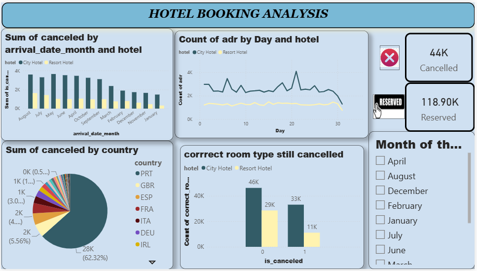

# 🏨 Hotel Booking Cancellation Analysis

## 📌 Project Overview

The **Hotel Booking Cancellation Analysis** project focuses on analyzing hotel booking data to understand cancellation patterns, customer booking behavior, and the factors that influence booking cancellations.

The project uses **Power BI** to transform raw hotel booking data into an interactive dashboard that provides meaningful business insights and helps identify opportunities to reduce cancellation rates and improve hotel revenue.

---

## 🎯 Project Objectives

The main objectives of this project are to:

* Analyze hotel booking and cancellation patterns.
* Understand the factors influencing booking cancellations.
* Compare cancellation rates across different hotel types.
* Analyze customer booking behavior.
* Identify trends in cancellations over time.
* Analyze the impact of lead time on cancellations.
* Understand the relationship between booking characteristics and cancellations.
* Create an interactive dashboard for business decision-making.
* Generate actionable insights to help reduce cancellation-related revenue loss.

---

## 🛠️ Tools & Technologies

| Tool                     | Purpose                                 |
| ------------------------ | --------------------------------------- |
| 📊 Power BI              | Dashboard development and visualization |
| 🔢 DAX                   | Calculations and KPIs                   |
| 📈 Data Visualization    | Business insights and trend analysis    |
| 🧹 Data Cleaning         | Preparing data for analysis             |
| 📊 Business Intelligence | Decision-making and reporting           |

---

## 📂 Project Files

```text
Hotel-Booking-Cancellation-Analysis/
│
├── Hotel_Booking_Cancellation_Analysis.pbix
│   └── Power BI dashboard
│
├── Hotel_Booking_Cancellation_Analysis.pdf
│   └── PDF version of the dashboard
│
├── dataset/
│   └── hotel_booking.csv
│
├── images/
│   └── dashboard_preview.png
│
└── README.md
```

> **Note:** Update the filenames above if your actual uploaded files have different names.

---

## 📊 Key Performance Indicators

The dashboard focuses on important hotel booking KPIs such as:

* **Total Bookings**
* **Total Cancellations**
* **Cancellation Rate**
* **Confirmed Bookings**
* **Average Lead Time**
* **Average Daily Rate (ADR)**
* **Revenue-related metrics**

These KPIs provide a quick overview of booking performance and cancellation behavior.

---

## 🔍 Analysis Performed

The project analyzes several aspects of hotel bookings, including:

### 🏨 Hotel Type Analysis

Comparison of booking and cancellation behavior between different hotel types.

### 📅 Time-Based Analysis

Analysis of booking and cancellation trends across:

* Years
* Months
* Seasonal periods

### 👥 Customer Analysis

Understanding how customer-related characteristics influence booking cancellations.

### ⏱️ Lead Time Analysis

Analyzing whether longer booking lead times are associated with higher cancellation rates.

### 💰 Revenue Analysis

Examining how cancellations can potentially affect hotel revenue and identifying booking characteristics associated with higher-value reservations.

### 🌍 Market Segment Analysis

Comparing cancellation behavior across different market segments and booking channels.

---

## 📈 Dashboard Features

The Power BI dashboard provides:

* KPI cards
* Cancellation rate analysis
* Booking trend analysis
* Hotel type comparison
* Customer segmentation
* Lead time analysis
* Market segment analysis
* Booking channel analysis
* Interactive slicers and filters
* Dynamic visualizations

Users can interact with the dashboard to explore different dimensions of hotel booking behavior.

---

## 💡 Key Business Insights

The analysis helps identify:

* The overall proportion of bookings that are cancelled.
* Which hotel types experience higher cancellation rates.
* How booking lead time relates to cancellations.
* Seasonal patterns in hotel bookings.
* Customer and market segments associated with cancellations.
* Booking channels that may have higher cancellation rates.
* Potential areas where hotels can improve cancellation management.

These insights can help hotels develop strategies to **reduce cancellations, improve occupancy, optimize pricing, and protect revenue**.


## 🔄 Project Workflow

Raw Hotel Booking Data
          ↓
Data Cleaning & Preparation
          ↓
Data Exploration
          ↓
KPI Development
          ↓
Power BI Data Modeling
          ↓
DAX Calculations
          ↓
Interactive Dashboard
          ↓
Business Insights
          ↓
Decision Making


## 📷 Dashboard Preview

The completed Power BI dashboard provides an interactive view of hotel booking and cancellation performance.


## 📷 Dashboard Preview




### 3. Explore the dashboard

Use the available filters and slicers to analyze:

* Hotel type
* Booking status
* Customer characteristics
* Market segment
* Booking channel
* Time periods
* Lead time
* Revenue-related metrics


## 📚 Skills Demonstrated

This project demonstrates practical skills in:

* Data Analysis
* Data Cleaning
* Exploratory Analysis
* Business Intelligence
* Power BI
* DAX
* Data Visualization
* KPI Development
* Dashboard Design
* Business Insight Generation
* Hotel Industry Analytics
* Data-Driven Decision Making


